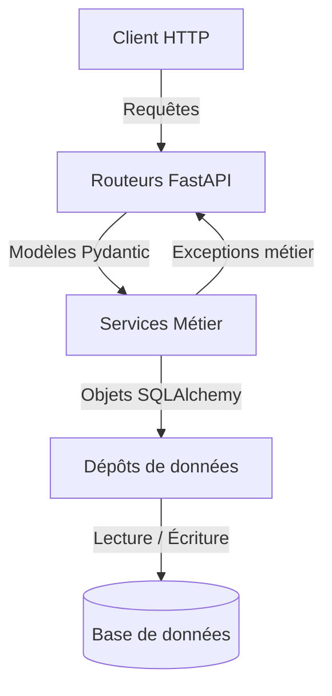

# API catalogue de jeux

API REST pour gérer un catalogue de jeux vidéo, avec authentification, gestion des éditeurs, statistiques et administration.

## Prérequis

- Python 3.12
- PostgreSQL 16 ou une base locale compatible
- Git
- Un terminal PowerShell, CMD ou bash

## Démarrage rapide

1. Créez et activez un environnement virtuel.
2. Installez les dépendances.
3. Copiez le fichier de configuration et remplissez les variables requises.
4. Lancez l’API.

```bash
py -m venv .venv
# PowerShell
. .\.venv\Scripts\Activate.ps1
# Bash / zsh
# source .venv/bin/activate

python -m pip install -r requirements.txt
copy .env.example .env
# puis éditez .env pour remplacer :
# - DATABASE_URL avec l’URL de votre base PostgreSQL
# - CLE_SECRETE avec une clé secrète aléatoire

python -m uvicorn app.main:app --reload
```

Ouvrez ensuite http://localhost:8000/docs : la documentation Swagger de l’API doit s’afficher avec la liste des routes.

## Configuration

Les variables d'environnement sont gérées dans `app/config.py`. Voici les variables disponibles (à mettre dans votre `.env`) :

| Variable | Obligatoire | Valeur par défaut | Description |
|---|---|---|---|
| `DATABASE_URL` | **Oui** | - | URL de connexion à la base de données (ex: `sqlite:///jeux.db`) |
| `CLE_SECRETE` | **Oui** | - | Clé pour signer les jetons JWT |
| `ALGORITHME_JETON` | Non | `HS256` | Algorithme de signature des jetons |
| `DUREE_JETON_MINUTES` | Non | `30` | Durée de validité des jetons |
| `ORIGINES_AUTORISEES` | Non | `http://localhost:5173` | CORS autorisés (séparés par des virgules ou tableau JSON) |
| `ENVIRONNEMENT` | Non | `developpement` | `developpement` ou `production` |
| `NIVEAU_JOURNAL` | Non | `INFO` | Niveau de logs (DEBUG, INFO, WARNING, ERROR) |
| `ECHO_SQL` | Non | `False` | Si `True`, SQLAlchemy affichera les requêtes exécutées |
| `MAX_TENTATIVES_CONNEXION`| Non | `5` | Nombre max d'échecs de connexion avant blocage |
| `FENETRE_TENTATIVES_MINUTES`| Non | `15` | Temps de blocage après échecs |

## Utilisation

L'API est documentée interactivement sur [http://localhost:8000/docs](http://localhost:8000/docs).

Exemples de requêtes :
- Lister les jeux : `GET /jeux`
- Récupérer un jeu : `GET /jeux/1`
- Rechercher par titre : `GET /jeux?recherche=zelda`

## Tests

Pour lancer les tests automatisés et la vérification du code (linter) :

```bash
# Installer les dépendances de développement
python -m pip install -r requirements-dev.txt

# Lancer les tests
pytest

# Vérifier le code avec Ruff
ruff check .
```

## Architecture

Le code suit une architecture en couches strictes :



Dossiers principaux dans `app/` :
- `routeurs/` : Points d'entrée HTTP, vérification des rôles et traduction en réponses JSON.
- `modeles/` : Schémas Pydantic pour valider ce qui entre et sort de l'API.
- `services/` : Logique métier et règles de l'application (ne connait ni HTTP, ni la base).
- `depots/` : Code d'accès aux données avec SQLAlchemy.
- `tables/` : Définition de la structure des tables SQL.

## Contribuer

Pour contribuer au projet, nous suivons la règle : **celui qui produit ne valide jamais seul.**
1. Choisissez ou créez une issue.
2. Créez une branche nommée `type/numero-description` (ex: `feat/42-ajout-route`).
3. Travaillez et faites des commits conventionnels (`feat(domaine): message`).
4. Poussez votre branche et ouvrez une Pull Request.
5. Faites relire votre code par un autre membre de l'équipe (Approve requis).
6. Fusionnez avec "Squash and merge".
